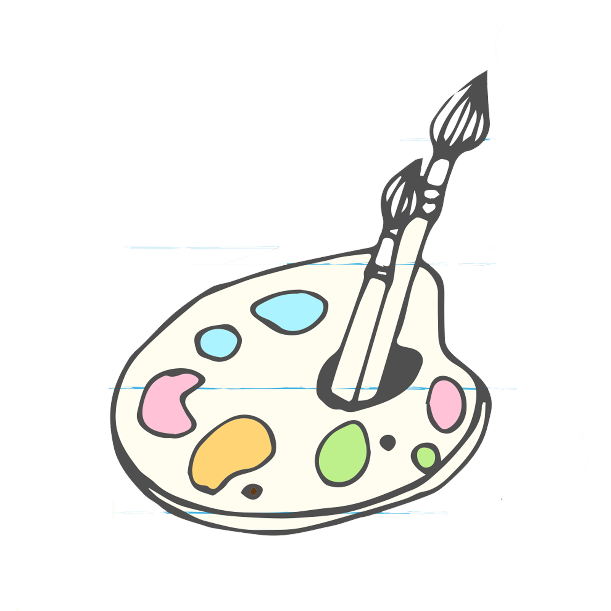

<h1 align="center">画板</h1>
<p align="center">

</p>
<p align="center">


</p>

## 项目介绍

该仓库为 Java 语言程序设计大作业，队伍成员有[amtoaer](https://github.com/amtoaer)、[RayK](https://github.com/Reilkay)和[clover3333](https://github.com/clover3333)。

## 运行使用

下载[release 界面](https://github.com/amtoaer/java-drawing-board/releases)的最新版本`DrawBoard.jar`，使用以下命令运行：

```bash
java -jar DrawBoard.jar
```

## 当前功能

- [x] 绘制直线、矩形、圆等离散图
- [x] 绘制铅笔、橡皮擦等连续图
- [x] 添加文本框
- [x] 读取系统字体
- [x] 设置字体、字号
- [x] 按住拖动时的实时绘制
- [x] 线条粗细调整
- [x] 使用自定义颜色
- [x] 修改前景色，背景色
- [x] 操作撤销
- [x] 保存为图片
- [x] 从文件读取
- [x] 清空画板
- [x] 快捷键触发

## 项目结构

```bash
.
└── src
    ├── Colorlist.java #颜色选择区域
    ├── Drawboard.java #绘图区域
    ├── Eraser.java #橡皮擦类
    ├── EventListener.java #事件监听器以及核心绘图逻辑
    ├── Linewidth.java #线条粗细组件
    ├── MultiShape.java #直线、矩形和圆的实现
    ├── Shape.java #图形基类（派生出橡皮擦和文本框）
    ├── TextShape.java #文本框类
    ├── Toolbar.java #工具栏界面
    ├── Utils.java #工具类（获取系统字体列表和程序帮助信息）
    └── Window.java #程序入口
```

## 开发进度

详见[待办事项](https://github.com/amtoaer/java-drawing-board/projects/1)。

## 版本发布

该仓库已经进行了`CI`的配置，对于开发人员，可以通过**为某次`commit`添加`tag`并`push`到仓库**来触发自动构建，以基础版本的构建为例：

```bash
git tag -a '0.1.0' -m '基础版本'
git push --tags
```

## 许可证

MIT LICENSE.
